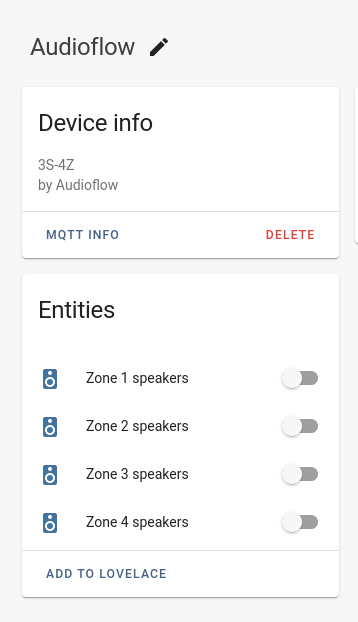

# Audioflow to MQTT Gateway

audioflow2mqtt enables local control of your Audioflow speaker switch via MQTT. It supports Home Assistant MQTT discovery for easy integration. It can also automatically discover the Audioflow device on your network via UDP discovery, or you can specify the IP address of the Audioflow device if you don't want to use UDP discovery. Currently only supports one Audioflow device unless you run separate instances (see the "important notes" section at the end of the readme for details).

# Docker Compose
Example compose file with all possible environmental variables listed:
```yaml
version: '3'
services:
  audioflow2mqtt:
    container_name: audioflow2mqtt
    image: tediore/audioflow2mqtt:latest
    environment:
    - MQTT_HOST=10.0.0.2
    - MQTT_PORT=1883
    - MQTT_USER=user
    - MQTT_PASSWORD=password
    - MQTT_QOS=1
    - BASE_TOPIC=audioflow2mqtt
    - HOME_ASSISTANT=True
    - DEVICE_IP=10.0.1.100
    - DISCOVERY_PORT=54321
    - LOG_LEVEL=debug
    restart: unless-stopped
    network_mode: host # only required if DEVICE_IP is not set
```

# Configuration
| Variable | Default | Description |
|----------|---------|-------------|
| `MQTT_HOST` | None | IP address or hostname of the MQTT broker to connect to. |
| `MQTT_PORT` | 1883 | The port the MQTT broker is bound to. |
| `MQTT_USER` | None | The user to send to the MQTT broker. |
| `MQTT_PASSWORD` | None | The password to send to the MQTT broker. |
| `MQTT_QOS` | 1 | The MQTT QoS level. |
| `BASE_TOPIC` | audioflow2mqtt | The topic prefix to use for all payloads. |
| `HOME_ASSISTANT` | True | Set to `True` to enable Home Assistant MQTT discovery or `False` to disable. |
| `DEVICE_IP` | None | IP address of your Audioflow device. Only required if you don't plan to use UDP discovery. |
| `DISCOVERY_PORT` | 54321 | The port to open on the host to send/receive UDP discovery packets. |
| `LOG_LEVEL` | info | Set minimum log level. Valid options are `debug`, `info`, `warning`, and `error` |

# Home Assistant
audioflow2mqtt supports Home Assistant MQTT discovery which creates a Device for the Audioflow switch and entities for each zone.



# MQTT topic structure and examples
The command topics start with `BASE_TOPIC/serial_number/command/zone_number` where `BASE_TOPIC` is the base topic you define, `serial_number` is the device serial number (found on the sticker on the bottom of the device), `command` is one of the below commands, and `zone_number` is the zone you want to control (zone A on the switch is zone number 1, zone B is zone number 2, and so on).

Valid commands are `set_zone_state`, `set_all_zone_states`, and `set_zone_enable`. The examples below assume the base topic is the default (`audioflow2mqtt`) and the serial number is `0123456789`.

**Turn zone B (zone number 2) on or off, or toggle between states**

Topic: `audioflow2mqtt/0123456789/set_zone_state/2`

Valid payloads: `on`, `off`, `toggle`

**Turn all zones on or off**

Topic: `audioflow2mqtt/0123456789/set_all_zone_states`

Valid payloads: `on`, `off`

**Enable or disable zone A (zone number 1)**
_This might not really be something you would do, but I figured I'd add it anyway_

Topic: `audioflow2mqtt/0123456789/set_zone_enable/1`

Valid payloads: `1` for enabled, `0` for disabled

<br>

When the zone state or enabled/disabled status is changed, audioflow2mqtt publishes the result to the following topics:

**Zone state:** `audioflow2mqtt/0123456789/ZONE/zone_state`

**Zone enabled/disabled:** `audioflow2mqtt/0123456789/ZONE/zone_enabled`

# Important notes
When running separate instances for multiple devices, you will need to set a **different base topic for each instance**. Also, while audioflow2mqtt does support UDP discovery of Audioflow devices, creating a DHCP reservation for your Audioflow device(s) and setting `DEVICE_IP` is recommended. UDP discovery will only work if the Audioflow device is on the same subnet as the machine audioflow2mqtt is running on.

<br>
<a href="https://www.buymeacoffee.com/tediore" target="_blank"></a>


# TODO
1. ~~Handle Audioflow device disconnects/reconnects~~
2. Add support for re-discovery of Audioflow switch if its IP address changes
3. Add support for multiple Audioflow switches? Not sure how many people would have more than one.
4. You tell me!
